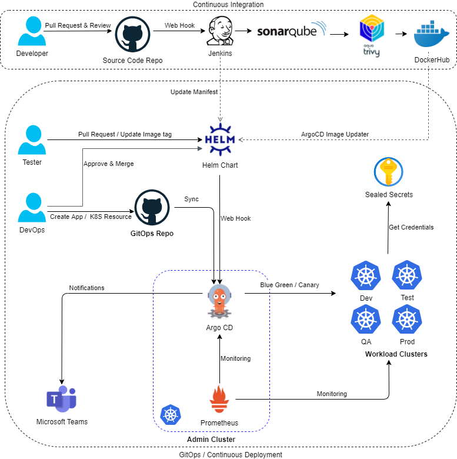

# GitOps for Kubernetes - Automate Everything

This repository uses [Argo CD](https://argoproj.github.io/argo-cd/) as the [GitOps](https://www.weave.works/technologies/gitops/) engine to manage infrastructure components (Ingress Controller, CI/CD, Logging, Monitoring, Velero...) as well as business applications in Kubernetes environments.
It should not be seen as production ready because it's set up in a local development environment.

