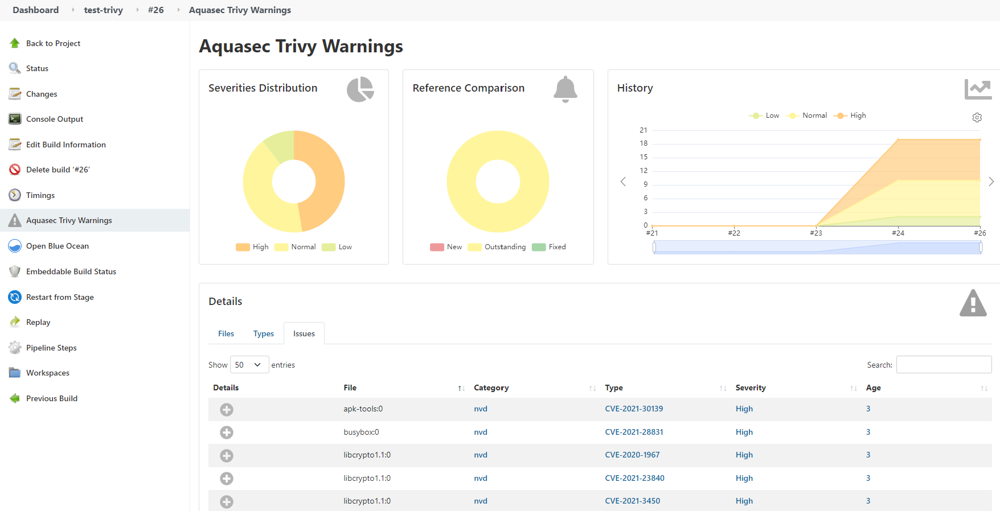

# Security

## Unified Secret Management with Azure Key Vault

We use Azure Key Vault to store all the credentials and they will be synchronized to Kubernetes automatically.
ArgoCD and Jenkins will pick up these secrets and use them internally.

## Role Based Access Control with LDAP

Currently ArgoCD and Jenkins are integrated with LDAP. Here are a list of LDAP groups and their permissions.

| LDAP Group         |                      Permissions                       |
| :----------------- | :----------------------------------------------------: |
| g_ArgoCD_Admin     |     All permissions to ArgoCD. Currently not used.     |
| g_ArgoCD_Operator  | All permission to ArgoCD applications except deletion. |
| g_ArgoCD_Reader    |                  Read-only to ArgoCD                   |
| g_Jenkins_Admin    |              All permissions to Jenkins.               |
| g_Jenkins_Operator |     Overall Read-only to Jenkins, can build jobs.      |
| g_Jenkins_Reader   |                 Read-only to Jenkins.                  |

## Automated Certificate Creation and Renewal

We use cert-manger to generate self-signed certificates to our tools such as ArgoCD, Jenkins, etc.
The certificate will also be renewed automatically when it expires.

## Build Container Images with Kaniko

We use kaniko to build container images from Dockerfile, inside a container. Using the old Docker-in-Docker build method has following drawbacks:

- Docker-in-Docker requires privileged mode to function, which is a significant security concern.
- Docker-in-Docker generally incurs a performance penalty and can be quite slow.
- Docker will be deprecated in Kubernetes in the future.

## Container Vulnerability Scanning with Trivy

We can use Trivy (also default scanner in Harbor) to scan vulnerabilities in our container images in Jenkins pipeline. Together with the warnings-ng plugin in Jenkins, a vulnerbility dashboard can be displayed.

