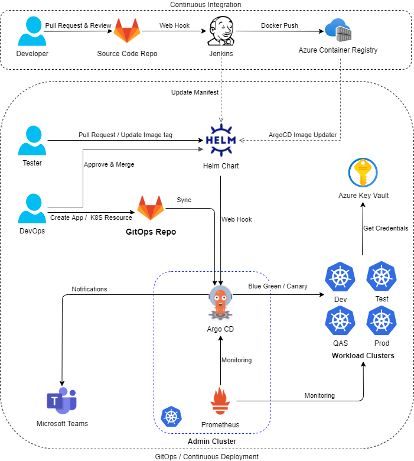

# Overview

We use [Argo CD](https://argoproj.github.io/argo-cd/) as the [GitOps](https://www.weave.works/technologies/gitops/) engine to manage infrastructure components (Argo CD, Ingress Controller, Jenkins, SonarQube, ...) as well as business applications in our Kubernetes environments. The goal of the project is to manage all K8S resources in ArgoCD so that users don't have to do it manually through CLI.

## Features

- Infrastructure as Code
- Observability
- Auditability & Compliance
- Self-Healing
- Easy to Rollback
- Blue-Green/Canary/Progressive Update Strategy
- LDAP Integration

## Technologies

### GitOps Solution

- GitOps
- Kubernetes
- [Nginx Ingress Controller](https://kubernetes.github.io/ingress-nginx/)
- [Helm](https://helm.sh/)
- [kustomize](https://kustomize.io/)
- [Argo CD](https://argoproj.github.io/argo-cd/)
- [ApplicationSet Controller](https://argocd-applicationset.readthedocs.io/en/stable/)
- [Argo CD Notifications](https://argocd-notifications.readthedocs.io/en/stable/)
- [Argo CD Image Updater](https://argocd-image-updater.readthedocs.io/en/stable/)
- [Argo Rollouts](https://argoproj.github.io/argo-rollouts/)
- [sealed-secrets](https://github.com/bitnami-labs/sealed-secrets)
- [cert-manager](https://cert-manager.io/docs/)

### GitOps Managed Resources

- Jenkins
- SonarQube
- Nexus
- [Velero](https://github.com/vmware-tanzu/velero)
- [Kaniko](https://github.com/GoogleContainerTools/kaniko)
- [Trivy](https://aquasecurity.github.io/trivy/v0.18.3/)
- [Elastic Cloud on Kubernetes](https://www.elastic.co/guide/en/cloud-on-k8s/current/index.html)
- [kube-prometheus-stack](https://github.com/prometheus-community/helm-charts/tree/main/charts/kube-prometheus-stack)
