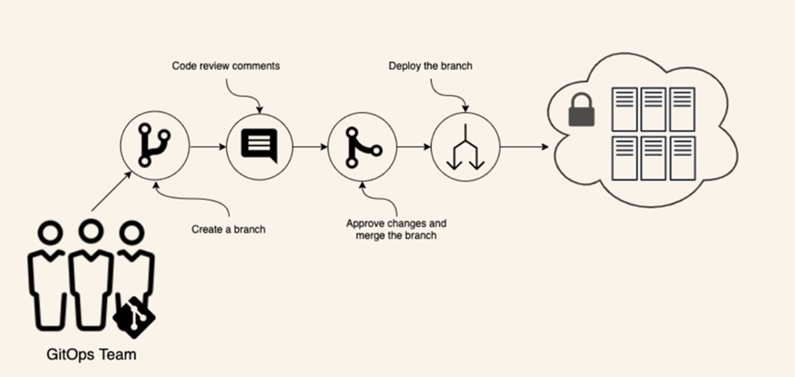

# Understanding GitOps

GitOps is a new method of Continuous Deployment that uses Git as a single source of truth for declarative infrastructure and applications, providing both revision and change control. With GitOps, a system is operated by the submission of pull requests (and subsequent merges) to the desired state of the system represented in a Git repository.

## Benifits

- Infrastructure as Code (Reproducible deployment)
- Code Reviews (Four-eyes principle)
- Declarative (Create a VM vs I have a VM)
- Observability
- Auditability & Compliance (Who changed what, when)
- Disaster Recovery
- One Click Rollback
- Reduce Inconsistency between Environments
- Better Knowledge Transfer
